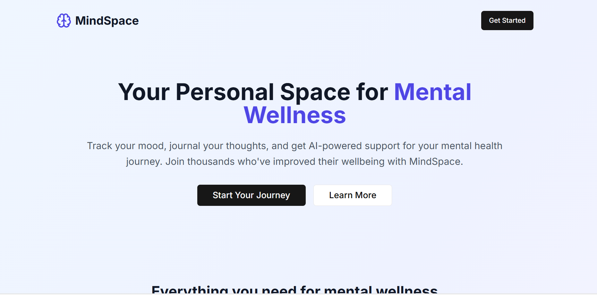
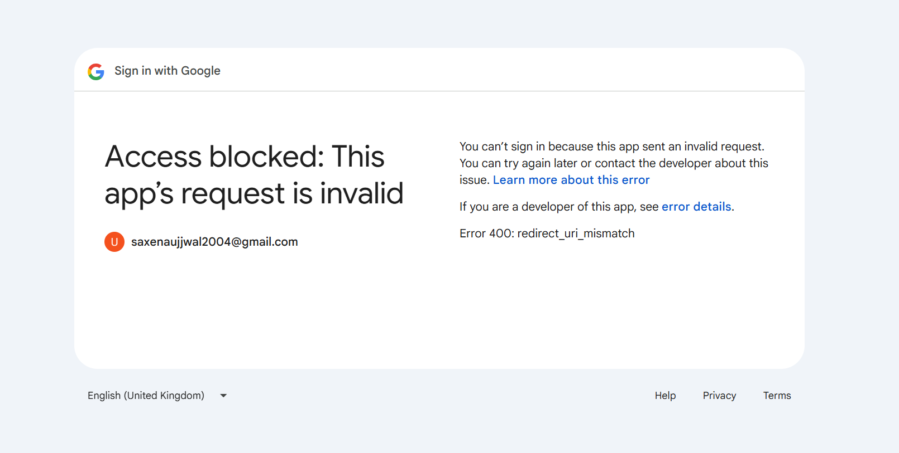
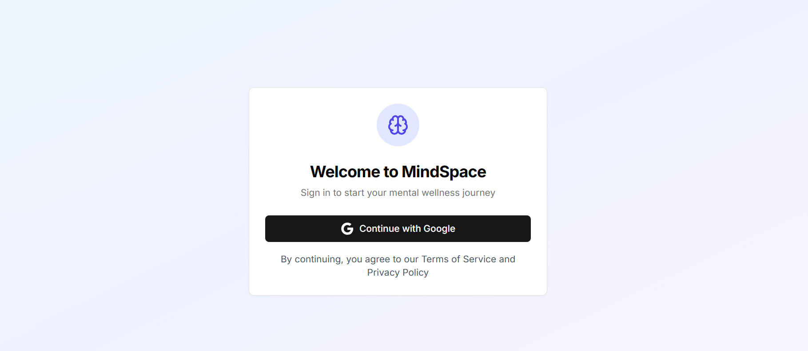
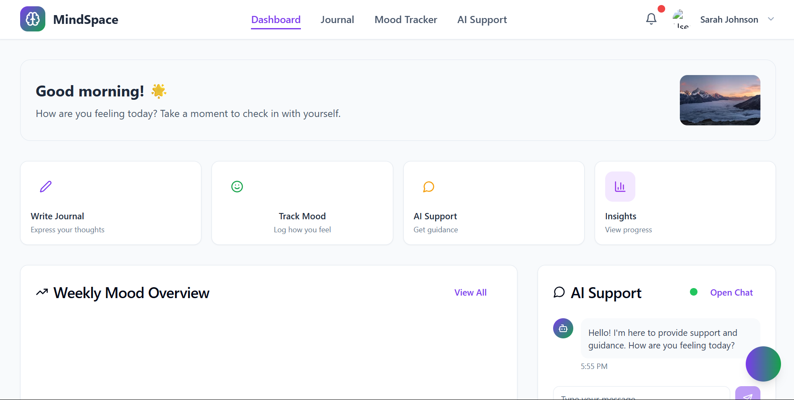
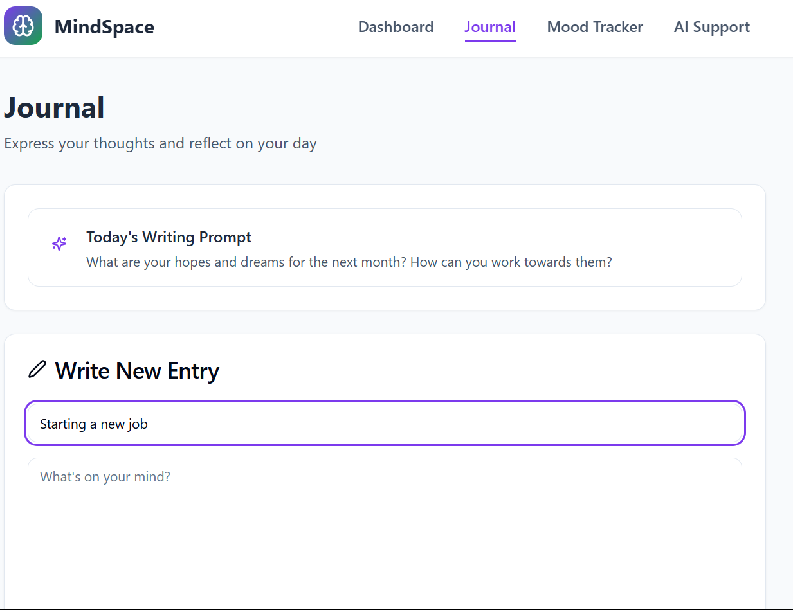
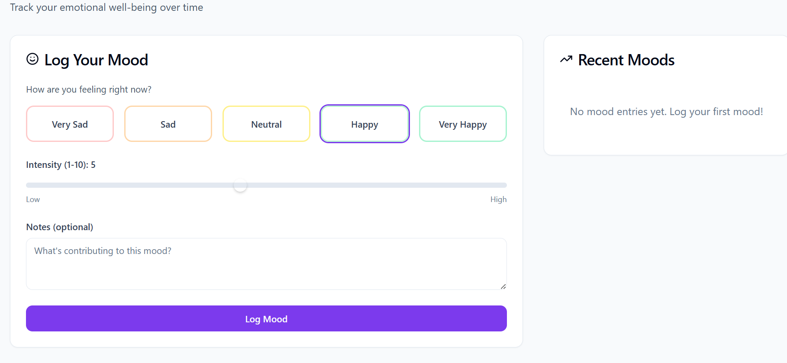
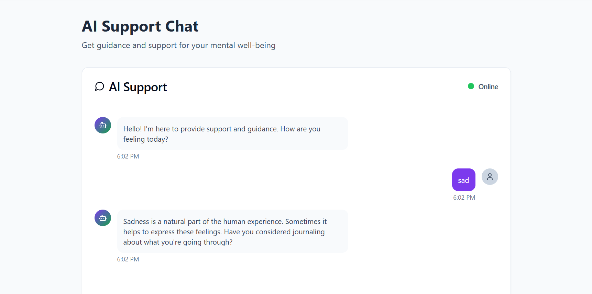

🛠️ IMPORTANT NOTE: While the main branch reflects the latest stable version of the project, all prior development, hard work, and detailed commit history can be found in the other branches:
1)backup-before-upgrade
2)backup-before-upgrade-2

These branches preserve the complete evolution of the project and showcase the foundational effort behind this final build.

------------------------------------------------------------------------------------------------------------------------------------------------------------------------------

MindSpace 🧠
A full-stack mental wellness platform designed to be a personal space for users to track their mood, journal their thoughts, and receive AI-powered support. It provides a secure, intuitive, and real-time interface to help users on their mental health journey.

---

🧩 Tech Stack
Framework: Next.js

Frontend: React.js, TypeScript, Tailwind CSS

UI Components: shadcn/ui & Radix UI

Authentication: NextAuth.js

Backend & Database: Supabase (Auth, PostgreSQL)

---

✨ Features
🔐 Secure Google Authentication via NextAuth.js and Supabase

📊 Mood Tracking to log and visualize emotional states over time

✍️ Private Journaling for users to document their thoughts and feelings

🤖 AI-Powered Support (planned feature) to provide insights and encouragement

📱 Clean and Responsive UI for a seamless experience on any device

📈 Data persistence with a PostgreSQL database managed by Supabase

---

 📸 Screenshots

 🏠 Starting Page
*The initial landing page for the application.*

🔑 Signing In
*The clean and simple sign-in page.*

🔒 Google Authentication
*The secure Google authentication prompt.*

 📈 User Dashboard
*The central hub for accessing all features after logging in.*

 ✍️ Journal Writing
*A clean and private space for users to write journal entries.*

 😊 Mood Tracker
*An intuitive interface for logging daily moods.*

 🤖 AI Chatbot
*AI-powered support to provide insights and encouragement.*

---

📦 Future Improvements
✅ Improvise the AI Chatbot for more supportive conversations

✅ Develop detailed analytics and visualizations for mood trends

✅ Add guided meditations or breathing exercises

✅ Introduce goal setting and habit tracking features

✅ Enable data export for users to share with therapists 
